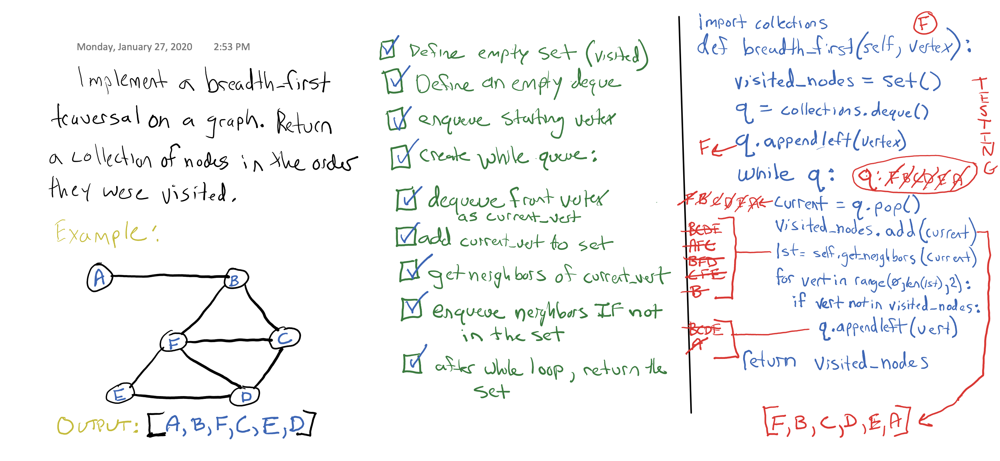

# Data Structures - Graph (Breadth_First Traversal)

**Author**: Stephen Koch
**Version**: 1.0.0

### Overview
In this module, we are adding a traversal method to the Graph class created above this module. As the name states, this is a breadth first traversal method. 

### Approach & Efficiency
Python's built-in set and deque are used for this traversal. The set is a hash table with only keys - When we want to return a "collection of nodes in the order they were visited" we need to cover all of the edges in the graph without repeating any vertices. A set works perfectly for this.

The deque is a built-in from python's collections library. The deque functions as a queue. During a breadth first traversal the idea is to go "wide", so for every vertex that we dequeue we enqueue all of its neighbors before proceeding "deeper" into the graph.

This solution seems to be close to O(N^2) for time. We need to go through each unique node once, then for each node we need to check all of its neighbors. If this was a complete graph (all vertices pointing to all others) this would 100% be an O(N^2) for time. Maybe it is best to say that in that 'worst case' this method is O(N^2) for time efficency. 

For space efficency it is O(N). We are creating a set that is exactly N in length (by nature sets have all unique nodes).

### API
Our Graph now has seven public methods:

1. add_node(value): adds a new vertex to the graph, returns the added vertex  
2. add_edge(vertex1, vertex2, [weight]): adds new edge between two virtices, takes in two verticies, has ability to add weight  
3. get_nodes( ) - returns all of the vertices as a collection  
4. get_neighbors(vertex): returns a collection of vertices (with weights) connected to a vertex, takes in a vertex  
5. get_values(vertex): returns the value from a given vertex  
6. size( ) - returns number of vertices in Graph; integer
7. breadth_first(vertex): traverses the graph starting from the given vertex, returns a list of nodes visited during traversal

### Solution

## Other Data Structures
### 1. [Linked List](https://github.com/kochsj/python-data-structures-and-algorithms/tree/master/Data-Structures/linked_list) 2. [Stacks and Queues](https://github.com/kochsj/python-data-structures-and-algorithms/tree/stack-and-queue/Data-Structures/stacks_and_queues) 3. [Binary Tree](https://github.com/kochsj/python-data-structures-and-algorithms/tree/stack-and-queue/Data-Structures/tree) 4. [Hash Table](https://github.com/kochsj/python-data-structures-and-algorithms/tree/stack-and-queue/Data-Structures/hashtable) 5. [Graph](https://github.com/kochsj/python-data-structures-and-algorithms/tree/stack-and-queue/Data-Structures/graphs)

