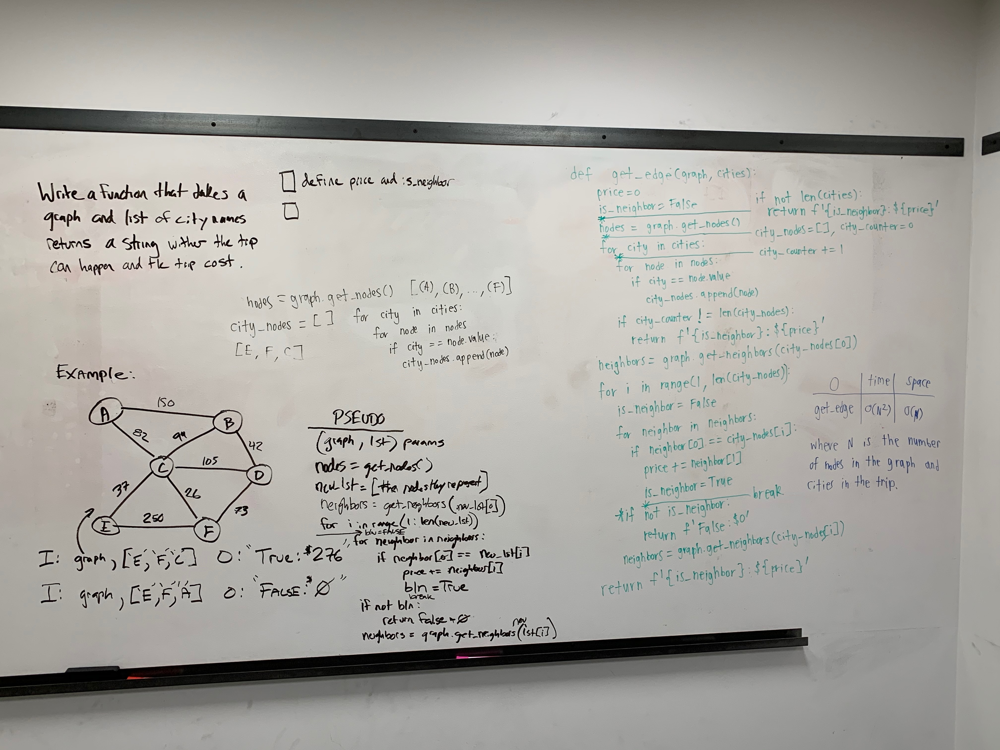

# Data Structures - Graph (Get Edge Function)

**Author**: Stephen Koch
**Version**: 1.0.0

### Overview
In this module, we are creating a function that checks if there is an edge or series of consecutive edges that exists between a list of nodes (represented by their values). 

If there is no such 'edge', we will return 'False : $0'.

If there is such an 'edge', we will return 'True : $[cost]'

### Approach & Efficiency
Function, get_edge, takes a graph and list of values as arguements. Determines if there are nodes in the graph with those values from the list. Determines if there are edges between adjacent nodes from the value_list. Returns True or False if there are edges between every node in the list - start to finish AND the cost of traversing those edges.

This solution seems to be close to O(N^2) for time. We need to go through each unique node once, then for each node we need to check all of its neighbors. If this was a complete graph (all vertices pointing to all others) this would 100% be an O(N^2) for time. Maybe it is best to say that in that 'worst case' this method is O(N^2) for time efficency. 

For space efficency it is O(N). We are creating a list of nodes that is exactly N nodes in length.

### API
get_edge(graph, value_list):

Parameters:
- [graph] - the graph to be checked for an "edge" and cost
- [value_list] - list of values representing nodes in the graph. Ordered from start to finish.

Return: 
- [string] - formatted string of "boolean : $cost"

### Solution

## Other Data Structures
### 1. [Linked List](https://github.com/kochsj/python-data-structures-and-algorithms/tree/master/Data-Structures/linked_list) 2. [Stacks and Queues](https://github.com/kochsj/python-data-structures-and-algorithms/tree/stack-and-queue/Data-Structures/stacks_and_queues) 3. [Binary Tree](https://github.com/kochsj/python-data-structures-and-algorithms/tree/master/Data-Structures/tree) 4. [Hash Table](https://github.com/kochsj/python-data-structures-and-algorithms/tree/master/Data-Structures/hashtable) 5. [Graph](https://github.com/kochsj/python-data-structures-and-algorithms/tree/master/Data-Structures/graphs/breadth_first)

