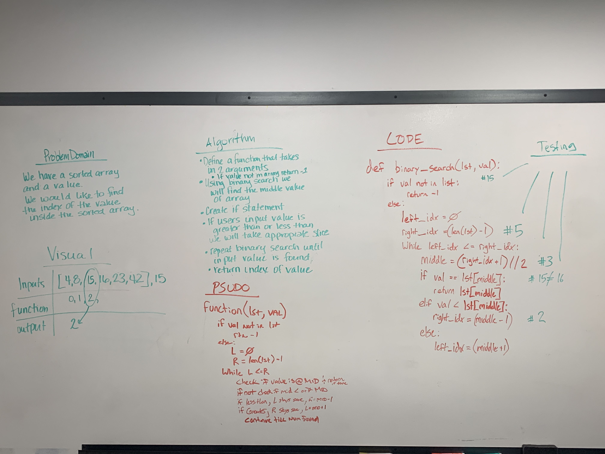

# Data-Structures-and-Algorithms - Code Challenge Three

# Array_Binary_Search

### Problem domain:
We have a sorted list of integers and a given value. We would like to know if the value is in the list. If it is, we would like to know at which index the value is located.

>inputs: ( [2, 4, 6, 8, 15, 16, 23, 40, 47] , 15 ) ---> output: 4   
### Challenge
Algorithm:
    1. Define a function that accepts two arguements(list, value)
    2. If value is not in the list, return -1
    3. Finds the middle of the list
    4. If the value is less than or greater than the input, the appropriate half will be taken (upper or lower half)
    5. Repeat binary search until value is found
    6. Return index of the value
### Approach & Efficiency
For this challenge I worked with Amy. We set out to write a simple function (d.r.y) that matched the algorithm we determined beforehand. It appears that this algorithm would be O(N) performance.
### Solution

### Other Challenges
#### 1. Code Challenge One - [Array_Reverse](https://github.com/kochsj/python-data-structures-and-algorithms/challenges/array_reverse.py) 2. Code Challenge Two - [Array_Shift](https://github.com/kochsj/python-data-structures-and-algorithms/challenges/array_shift) 3. Code Challenge Three - [Array_Binary_Search](https://github.com/kochsj/python-data-structures-and-algorithms/tree/master/challenges/array_binary_search) 4. Code Challenge Four - [Linked List Merge](https://github.com/kochsj/python-data-structures-and-algorithms/tree/master/challenges/ll_merge) 5. Code Challenge Five - [Queue with Stacks](https://github.com/kochsj/python-data-structures-and-algorithms/tree/master/challenges/queue_with_stacks) 6. Code Challenge Six - [FIFO Animal Shelter](https://github.com/kochsj/python-data-structures-and-algorithms/tree/master/challenges/fifo_animal_shelter) 7. Code Challenge Seven - [FizzBuzz Tree](https://github.com/kochsj/python-data-structures-and-algorithms/tree/master/challenges/fizz_buzz_tree) 8. Code Challenge Eight - [Multiple Bracket Validation](https://github.com/kochsj/python-data-structures-and-algorithms/tree/master/challenges/multi_bracket_validation) 9. Code Challenge Nine - [Breadth-First Binary Tree Traversal](https://github.com/kochsj/python-data-structures-and-algorithms/tree/master/challenges/breadth_first_tree) 10. Code Challenge Ten - [Insertion Sort](https://github.com/kochsj/python-data-structures-and-algorithms/tree/master/challenges/insertion_sort) 11. Code Challenge Eleven - [Merge Sort](https://github.com/kochsj/python-data-structures-and-algorithms/tree/master/challenges/merge_sort) 12. Code Challenge Twelve - [Quick Sort](https://github.com/kochsj/python-data-structures-and-algorithms/tree/master/challenges/quick_sort) 13. Code Challenge Thirteen - [Repeating Word Search](https://github.com/kochsj/python-data-structures-and-algorithms/tree/master/challenges/repeated_word) 14. Code Challenge Fourteen - [Tree Intersection](https://github.com/kochsj/python-data-structures-and-algorithms/tree/master/challenges/tree_intersection)
