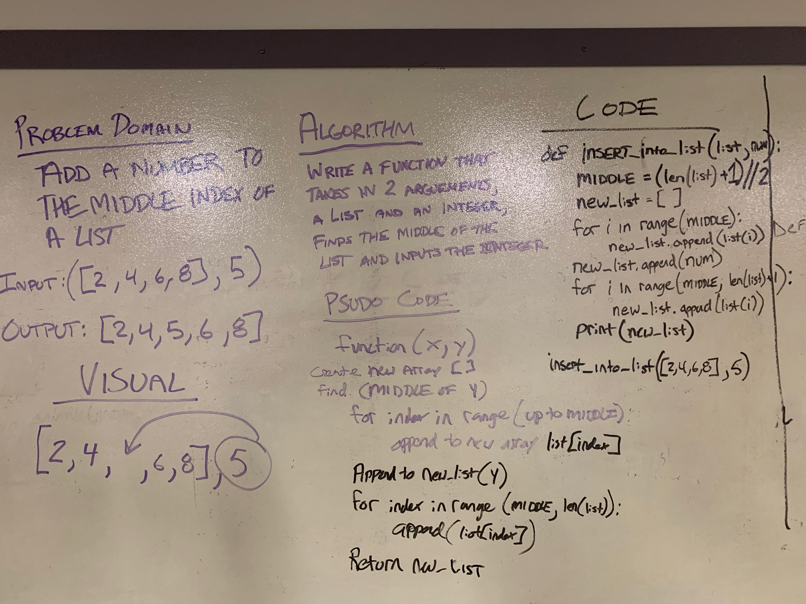

# Data-Structures-and-Algorithms - Challenge Two

# Array_Shift
### Problem domain
Write a function that adds a given number to the middle of a provided list: 
> inputs: [2, 4, 6, 8] and 5 -> output: [2, 4, 5, 6, 8]   
### Challenge
Algorithm:
    1. Define a function that accepts two arguements(list, integer)
    2. Finds the middle of the list
    3. Appends the first half of the list, integer in the middle, and last half of the list to a new list
    4. Returns the new list
### Approach & Efficiency
For this challenge I worked with Chris. We set out to write a simple function (d.r.y) that matched the algorithm we determined beforehand. It appears that this algorithm would be O(N) performance.
### Solution

### Other Challenges
#### 1. Code Challenge One - [Array_Reverse](https://github.com/kochsj/python-data-structures-and-algorithms/challenges/array_reverse.py) 2. Code Challenge Two - [Array_Shift](https://github.com/kochsj/python-data-structures-and-algorithms/challenges/array_shift) 3. Code Challenge Three - [Array_Binary_Search](https://github.com/kochsj/python-data-structures-and-algorithms/tree/master/challenges/array_binary_search) 4. Code Challenge Four - [Linked List Merge](https://github.com/kochsj/python-data-structures-and-algorithms/tree/master/challenges/ll_merge) 5. Code Challenge Five - [Queue with Stacks](https://github.com/kochsj/python-data-structures-and-algorithms/tree/master/challenges/queue_with_stacks) 6. Code Challenge Six - [FIFO Animal Shelter](https://github.com/kochsj/python-data-structures-and-algorithms/tree/master/challenges/fifo_animal_shelter) 7. Code Challenge Seven - [FizzBuzz Tree](https://github.com/kochsj/python-data-structures-and-algorithms/tree/master/challenges/fizz_buzz_tree) 8. Code Challenge Eight - [Multiple Bracket Validation](https://github.com/kochsj/python-data-structures-and-algorithms/tree/master/challenges/multi_bracket_validation) 9. Code Challenge Nine - [Breadth-First Binary Tree Traversal](https://github.com/kochsj/python-data-structures-and-algorithms/tree/master/challenges/breadth_first_tree) 10. Code Challenge Ten - [Insertion Sort](https://github.com/kochsj/python-data-structures-and-algorithms/tree/master/challenges/insertion_sort) 11. Code Challenge Eleven - [Merge Sort](https://github.com/kochsj/python-data-structures-and-algorithms/tree/master/challenges/merge_sort) 12. Code Challenge Twelve - [Quick Sort](https://github.com/kochsj/python-data-structures-and-algorithms/tree/master/challenges/quick_sort)
