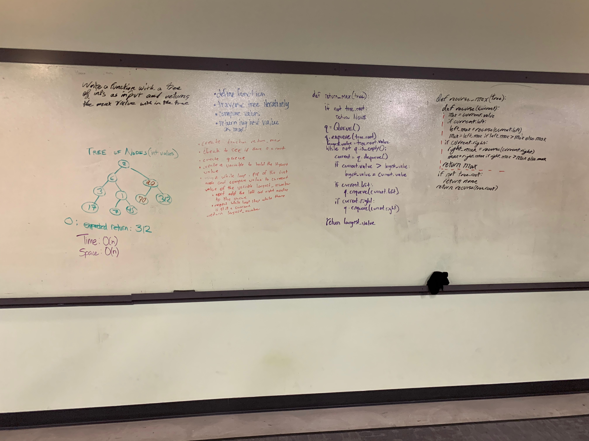

# Challenge - Breadth First (Binary Tree Traversal & Maximum Value)

**Author**: Stephen Koch
**Version**: 1.0.0

## Overview
In this module, we are writing 2 additional methods for the BinaryTree class called breadth_first and find_maximum_value. 

**Breadth_first** takes the binary tree of nodes (its self) as an arguement and returns a list of the values inside of those nodes; starting from the root and stretching the width of the tree left to right and top to bottom. 

That is what "breadth first" is describing. The breadth of the tree starting at the top, going from left to right. First. Meaning before going to the next "level" in the height of the binary tree. Here is an example:
```
State of a given tree:
      root: [2]
           /   \
         [7]   [5]
        /  \      \
      [2]  [6]     [9]
          /  \     /
        [5]  [11] [4]

Expected output from breadth_first method:
  [2, 7, 5, 2, 6, 9, 5, 11, 4]
```
As you can see, the method is reading the value of each of the nodes in the tree, starting with the root's level, moving to the next level (7 and 5 -- left to right), then moving farther down to the next level (2, 6, and 9), and after that level we reach the final level (5, then 11, then 4).

This is traversing a Binary Tree **breadth first**.

**Find_maximum_value** also takes the binary tree (it self) as an arguement and returns the highest value contained in the tree. The entire tree is traversed in the process using an iterative level approach. The variable maximum_value is assigned to the current node's value during the traversal only if the value of that node is larger than the maximum_value.

```
Given the same tree example from above...

Expected output from find_maximum_value method: 11
```

## Getting Started
Running tests is straight forward and involves using pytest.

First, make sure that you have python3 installed:
```
$ python3 --version
Python 3.7.5
```
If you do not:
```
$ brew install python
```
You need to have the files locally. Click on the green clone or download button and Download ZIP:


Navigate to your command line:
```
MacOS: Press command + space to open up the search feature
Search for "terminal" - This is your default command line on MacOS.
```
In your command line, navigate to this directory:
```
$ cd ~  ##this is your root directory
$ cd Downloads  ##by default: Downloads is a directory inside of your root; and where your file will be downloaded
$ cd python_data_structures_and_algorithims ##and now you are in this directory
```
This module is running tests on given data imputs. Install [pytest](https://docs.pytest.org/en/latest/getting-started.html) to get started:
Installing pytest:
```
$ pip install -U pytest
```
Running tests:
```
$ pytest
```

## Approach & Efficiency
The most efficent way to keep track of each node on each level before moving on has to be by using a queue. When a node is reached that means that it is at the front of the queue. So it is then safe to remove it from the queue -- dequeue it. 

When we remove the node from the queue, we want to take its value and append it to our list that is keeping track of all the values in the binary tree (breadth first). Additionally we need to add any and all the immediate children of the dequeued node to the end of the queue -- enqueue them.

As nodes get removed from the queue, and their children are added, eventually the final "level" of the tree will be reached. Meaning to say that there are no further children, no further levels. So the nodes will be dequeued like normal and when the queue is empty, that is when we can return our list of values.

Both methods have a big O of O(n) for time. Beacuse, every node in the tree has to have its value read before the list can be returned, the time will scale the same (n). 

Both methods differ for big O of space. With breadth_first method it will have O(n), because we are creating a list of n values, there will be n space taken in memory.  

With find_maximum_value, we are only are ever keeping track of one variable, but are adding the nodes from each level to the queue. This means that at the worst case, our space complexity will be O(w) where w is the "widest" level in the tree and where width is the number of nodes. 
 
## Solution:
Breadth First:


Return Max:


## Change Log
Mon Dec 30 2019 17:06:14<br>Created breadth_first method of the binary tree class. Wrote testing for proper functionality.


