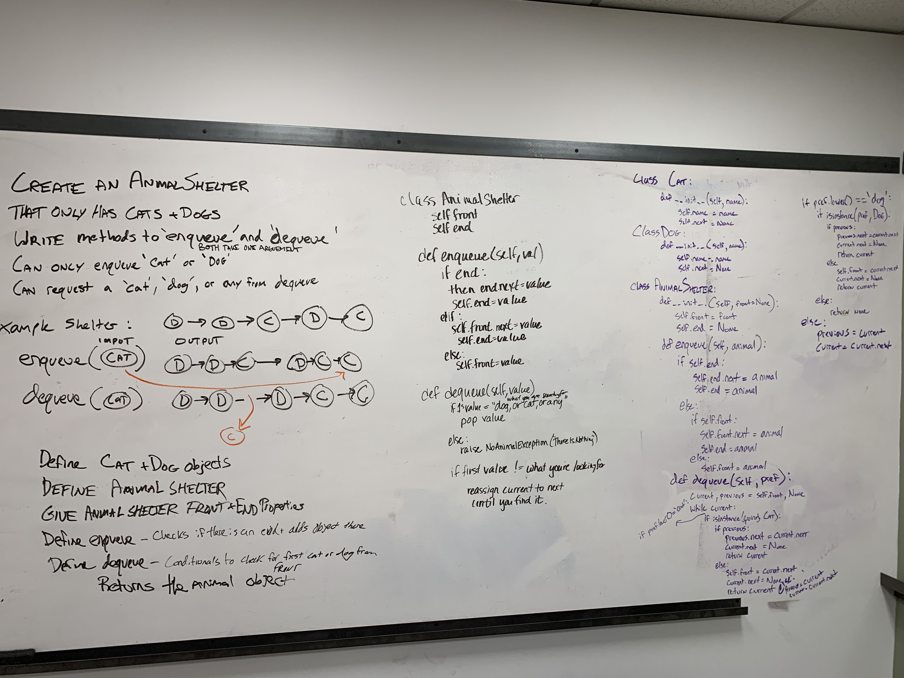

# Challenge - FIFO Animal Shelter

**Author**: Stephen Koch
**Version**: 1.0.0

## Overview
In this module, an AnimalShelter class is defined with two methods enqueue and dequeue. Dog classes and cat classes are defined and have a name and next property.

Queues only have access to the enqueue and dequeue methods can can not be traversed.

Enqueue - Adds an animal to the end of the queue. O(1) performance.

Dequeue - Removes an animal to the front of the queue. O(1) performance.



## Getting Started
Running tests is straight forward and involves using pytest.

First, make sure that you have python3 installed:
```
$ python3 --version
Python 3.7.5
```
If you do not:
```
$ brew install python
```
You need to have the files locally. Click on the green clone or download button and Download ZIP:


Navigate to your command line:
```
MacOS: Press command + space to open up the search feature
Search for terminal - This is your command line.
```
In your command line, navigate to this directory:
```
$ cd ~  ##this is your root directory
$ cd Downloads  ##by default: Downloads is a directory inside of your root; and where your file will be downloaded
$ cd python_data_structures_and_algorithims ##and now you are in this directory
```
This module is running tests on given data imputs. Install [pytest](https://docs.pytest.org/en/latest/getting-started.html) to get started:
Installing pytest:
```
$ pip install -U pytest
```
Running tests:
```
$ pytest
```
## Functionality/Architecture
This application is creating instances of Stacks, Nodes, and PseudoQueues.

Creating - When an instance of an AnimalShelter is created, it is created without any animal objects i.e an empty queue. Animal objects can be created and added by using the enqueue method of the AnimalShelter instance. By passing in 'dog' or 'cat' it creates a dog or a cat. If neither are specified, then no animal is added.

Enqueue('cat'/'dog') - In general, enqueuing to a queue adds a node to the end of the queue. It keeps reference to the previous end of the queue. It makes the previous end point to the new node. The end property of the queue points to the new node. The new node points to none. In the case of the AnimalShelter, enqueuing is adding a cat or a dog to the end of the AnimalShelter queue.

Dequeue('cat'/'dog') - In general, what we want to do when dequeuing from a queue, is to remove the front node from the queue. The next property of the front node is set to None. The front of the queue now points to the previous front's next node. In this case, with the AnimalShelter, we can pass dequeue the value 'dog' or 'cat' and it will remove the first dog or cat from the start of the line. 

## Change Log
Tue Dec 16 2019 16:04:49<br>Created AnimalShelter class, enqueue and dequeue methods. Wrote testing.


