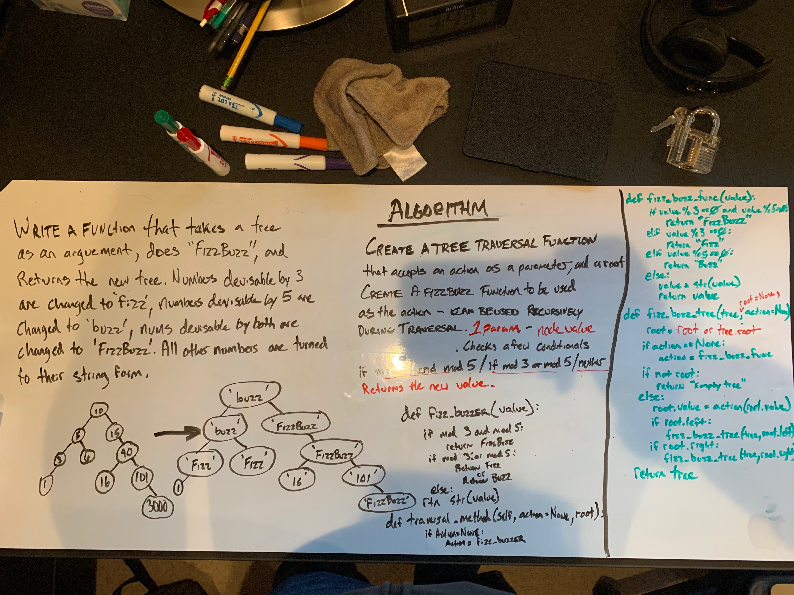

# Challenge - FizzBuzz Tree

**Author**: Stephen Koch
**Version**: 1.0.0

## Overview
In this module, we are writing a function "fizz_buzz_tree" that takes a binary tree of integers as an arguement and does "FizzBuzz" to the values in the binary tree.

Looking at every value in the binary tree, our function will determine that, if a value is evenly divisible by 3 its value will be reassigned to "Fizz". If the value is evenly divisible by 5 then its value will be reassigned to "Buzz". If the value is both evenly divisible by 3 and by 5, then its value will be reassigned to "FizzBuzz". If none of these conditions are met, then our function will reassign the integer to a string of the same value.

Example:
```
Starting Values => [2] -> [3] -> [5] -> [10] -> [15] -> [19]
After fizz_buzz_tree:
Returns => ['2'] -> ['Fizz'] -> ['Buzz'] -> ['Buzz'] -> ['FizzBuzz'] -> ['19']
```


## Approach & Efficiency
It was decided that using a helper function was going to be the best way to make these functions readable. Reference to the original BinaryTree object has to be kept during recursive traversal of the binary tree, so a tree parameter is used in the fizz_buzz_tree function. The tree parameter is never mutated during the traversal and value reassignment which is important.

The next parameter that is adjusted during traversal is the root parameter. This gives reference to the position in the stack that the function is operating on.

At each step in the binary tree, before invoking the function again, the value is reassigned to the return value from the helper fiz_buzz_func. 

Big O for this function is a factor O(n) for time, because every node in the tree must be accessed. More nodes means more time. This function is O(h) for space, as the height of the tree determines how far up the stack the function calls need to go before their 'left' and 'right' are completed and can be popped off the stack. 
 
## Solution:


### Other Challenges
#### 1. Code Challenge One - [Array_Reverse](https://github.com/kochsj/python-data-structures-and-algorithms/challenges/array_reverse.py)<br>2. Code Challenge Two - [Array_Shift](https://github.com/kochsj/python-data-structures-and-algorithms/challenges/array_shift)<br>3. Code Challenge Three - [Array_Binary_Search](https://github.com/kochsj/python-data-structures-and-algorithms/tree/master/challenges/array_binary_search)<br>4. Code Challenge Four - [Linked List Merge](https://github.com/kochsj/python-data-structures-and-algorithms/tree/master/challenges/ll_merge)<br>5. Code Challenge Five - [Queue with Stacks](https://github.com/kochsj/python-data-structures-and-algorithms/tree/master/challenges/queue_with_stacks)<br>6. Code Challenge Six - [FIFO Animal Shelter](https://github.com/kochsj/python-data-structures-and-algorithms/tree/master/challenges/fifo_animal_shelter)<br>7. Code Challenge Seven - [FizzBuzz Tree](https://github.com/kochsj/python-data-structures-and-algorithms/tree/master/challenges/fizz_buzz_tree)<br>8. Code Challenge Eight - [Multiple Bracket Validation](https://github.com/kochsj/python-data-structures-and-algorithms/tree/master/challenges/multi_bracket_validation)<br>9. Code Challenge Nine - [Breadth-First Binary Tree Traversal](https://github.com/kochsj/python-data-structures-and-algorithms/tree/master/challenges/breadth_first_tree)<br>10. Code Challenge Ten - [Insertion Sort](https://github.com/kochsj/python-data-structures-and-algorithms/tree/master/challenges/insertion_sort)<br>11. Code Challenge Eleven - [Merge Sort](https://github.com/kochsj/python-data-structures-and-algorithms/tree/master/challenges/merge_sort)<br>12. Code Challenge Twelve - [Quick Sort](https://github.com/kochsj/python-data-structures-and-algorithms/tree/master/challenges/quick_sort)


