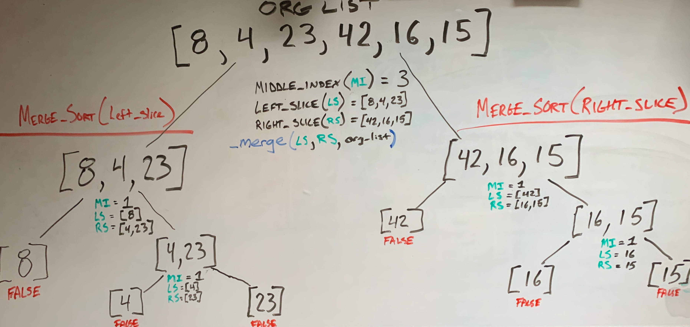
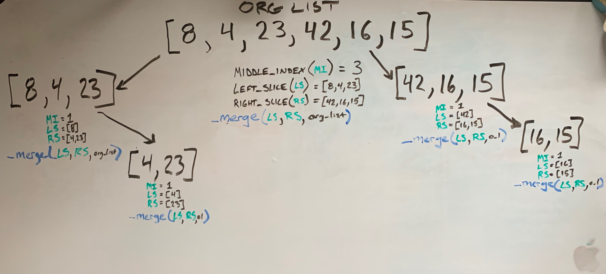
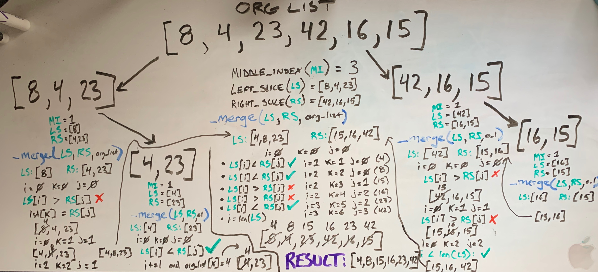

# Data-Structures-and-Algorithms - Challenge Ten

# Step-by-Step: Merge Sort
Say that you are given a list of integers in no perticular order and you would like them to be sorted. Without using any built-in functions, how would you do it?

There are many different algorithims that would get the job done. Let's take a look at the "merge sort" method of sorting.

```
def merge_sort(list_of_ints):
    """
    Function that accepts a list of integers as an arguement
    Sorts the integers in place by value using a merge-sort algorithm; low to high
    No return; sorts the list 'in-place'
    """
    
    if len(list_of_ints) > 1: # list is more than one element(for sorting)

        middle_index = len(list_of_ints)//2
        left_slice = list_of_ints[:middle_index] # left half
        right_slice = list_of_ints[middle_index:] # right half

        merge_sort(left_slice) # recursion down to 1 element

        merge_sort(right_slice) # recursion down to 1 element

        _merge(left_slice, right_slice, list_of_ints) # helper function to merge left and right
```
This function above, merge_sort, is invoking itself recursively. You can see from the lines ```merge_sort(left_slice)``` and ```merge_sort(right_slice)```.

Each time that the merge_sort function is invoked, it is taking in a "new" list_of_ints. More acturately, it is taking in a pointer to an existing slice of an existing <u>original list of integers</u> as a parameter. This splits up the left and right slices into smaller and smaller parts untill there are only two numbers to sort between. The line ```if len(list_of_ints) > 1:``` makes sure that there is no fewer than 2 integers in a list to be sorted.

Let's take a look at this list of integers: [8, 4, 23, 42, 16, 15] and visualize what happens each time ```merge_sort(left_slice)``` and ```merge_sort(right_slice)``` are invoked.



We can see in the image above, that from the original list, the middle index is defined and assigned to the value of the length of the list divided in half. (length:6)/2 = 3 • ```middle_index = 3```. 

Next, also seen above, we take the left slice of the original list and the right slice:
```
list_of_ints[:middle_index] = [8, 4, 23]
list_of_ints[middle_index:] = [46, 16, 15]
```
Then the function invokes itself again, this time using the slices as parameters. You can see in the image the result of the incursion. It continues untill there are lists with a length of one. Which will return false from our if-statement and will <b>not</b> be sorted. Shown as <span style="color: red;">False</span> in the image.

Let's simplify this visualization to include only the slices that will be sorted using the _merge helper function.



From the image right above, now we see that the merge_sort calls that will not be sorted (shown previously as returning <span style="color: red;">False</span>) have been removed from the image and we can focus on sorting the correct slices.

This brings us to the line in our merge_sort function ```_merge(left_slice, right_slice, list_of_ints)```. We need a function that will sort the smaller partition of the left and right...
```
def _merge(left, right, lst):
    """Responsible for merging a sorted right list of ints and sorted left list of ints together into one list"""
    i, j, k = 0,0,0

    while i < len(left) and j < len(right): # Assigns values of the final list starting at index 0 (k) the values of the lesser between left and right
        if left[i] <= right[j]:
            lst[k] = left[i]
            i += 1
        else:
            lst[k] = right[j]
            j += 1
        k += 1

    if i == len(left): # you have exhausted all values in the left
        while j < len(right):
            lst[k] = right[j]
            j += 1
            k += 1
    else: # you have exhausted all values in right
        while i < len(left):
            lst[k] = left[i]
            i += 1
            k += 1
```
What this function is responsible for is assigning the [ k ] index of the list that is passed in the lowest value between both the right and left slices of that list. Then the next lowest value at k + 1, and so on. Let's again use an image to visualize.



There is a lot going on there. Lets look at the slice [4, 23] in the lower left of the image. From the image we can see in <span style="color: green;">green</span> under [4, 23] -> the middle_index (<span style="color: green;">MI</span>), the left_slice (<span style="color: green;">LS</span>), and the right_slice (<span style="color: green;">RS</span>) at that moment. We can also see the values of i, j, and k; which all start at 0
```
MI = 1
LS = [4]
RS = [23]
i, j, k = 0, 0, 0
```
Knowing those, let's step through the _merge helper function. 
```while i < len(left) and j < len(right):```
```while (0) < (1) and (0) < (1): ~TRUE~```

This conditional is TRUE so we continue.
```
    if left[i] <= right[j]: ------>  if (4) <= (23): ~TRUE~
        lst[k] = left[i] ---------------> (4) = (4)
        i += 1  ------------------------>  (0) += 1 #i=1
    else:
        lst[k] = right[j]              State of list: [4, 23]
        j += 1
    k += 1 -----------------------------> (0) += 1 #k=1
```
So after our first iteration in our while loop, our list at index 0 is now 4 and i is now equal to 1 and k is now equal to 1. Let's check the while loop at the next iteration.
```while i < len(left) and j < len(right):```
```while (1) < (1) and (0) < (1): ~FALSE~```
This conditional is FALSE so we do not continue the while loop and move on to the next block of code.
```
    if i == len(left): -------------------> if (1) == (1): ~TRUE~
        while j < len(right):-----------------> while (0) < (1): ~TRUE~
            lst[k] = right[j] -------------------> (23) = (23)
            j += 1 ------------------------------> (0) += 1 #j=1
            k += 1 ------------------------------> (1) += 1 #k=2
    else: 
        while i < len(left):                State of list: [4, 23]
            lst[k] = left[i]
            i += 1
            k += 1
```
There. Our list is sorted. Well, it was sorted in the first place. So let's look at the next slice. This slice points to the right_slice of its parent [8, 4, 23] as seen in the image above.

We can step through [8, 4, 23]. From the image we can see in <span style="color: green;">green</span> under [8, 4, 23] -> the middle_index (<span style="color: green;">MI</span>), the left_slice (<span style="color: green;">LS</span>), and the right_slice (<span style="color: green;">RS</span>) at that moment. We can also see the values of i, j, and k; which all start at 0.
```
MI = 1
LS = [8]
RS = [4, 23] (THIS CAME FROM THE PREVIOUS SORT)
i, j, k = 0, 0, 0
```
Knowing those, let's step through the _merge helper function again. 
```while i < len(left) and j < len(right):```
```while (0) < (1) and (0) < (2): ~TRUE~```

This conditional is TRUE so we continue.
```
    if left[i] <= right[j]: ------>  if (8) <= (4): ~FALSE~
        lst[k] = left[i]
        i += 1                         
    else: --------------------------> else:
        lst[k] = right[j] --------------> (8) = (4)         State of list: [4, 4, 23]
        j += 1 -------------------------> (0) += 1 #j=1
    k += 1 -----------------------------> (0) += 1 #k=1
```
So after our first iteration in our while loop, our list at index 0 is now 4 and j is now equal to 1 and k is now equal to 1. i is still 0. Let's check the while loop at the next iteration.
```while i < len(left) and j < len(right):```
```while (0) < (1) and (1) < (2): ~TRUE~```

This conditional is TRUE so we continue.
```
    if left[i] <= right[j]: ------>  if (8) <= (23): ~TRUE~
        lst[k] = left[i] ---------------> (4) = (8)
        i += 1  ------------------------>  (0) += 1 #i=1
    else:
        lst[k] = right[j]              State of list: [4, 8, 23]
        j += 1
    k += 1 -----------------------------> (1) += 1 #k=2
```
So after this iteration, our list at index 1 is now 8, i is now 1, k is now 2, and j is still 1. Let's check the while loop before the next iteration.
```while i < len(left) and j < len(right):```
```while (1) < (1) and (1) < (2): ~FALSE~```

This conditional is FALSE so we do not continue the while loop and move on to the next block of code.
```
    if i == len(left): -------------------> if (1) == (1): ~TRUE~
        while j < len(right):-----------------> while (1) < (2): ~TRUE~
            lst[k] = right[j] -------------------> (23) = (23)
            j += 1 ------------------------------> (1) += 1 #j=2
            k += 1 ------------------------------> (2) += 1 #k=3
    else: 
        while i < len(left):                State of list: [4, 8, 23]
            lst[k] = left[i]
            i += 1
            k += 1
```
Perfect! Now this sub-list is sorted. Keep in mind too, that this slice still points to the left_slice of the ancestor [8, 4, 23, 42, 16, 15]. See if you can trace back from the right side using the image now!


Take a given sub-list from the image and notice the <span style="color: green;">green</span>. The middle_index (<span style="color: green;">MI</span>), the left_slice (<span style="color: green;">LS</span>), and the right_slice (<span style="color: green;">RS</span>). Also keep in mind the values of i, j, and k; which all start at 0.

Looking at the center of the image you will see the steps through the _merge helper function.
```
k[0] = 4   (LS[i] < RS[j])
k[1] = 8   (LS[i] < RS[j])
k[2] = 15  (LS[i] > RS[j])
k[3] = 16  (LS[i] > RS[j])
k[4] = 23  (LS[i] < RS[j])
k[5] = 42  (i == len(LS))
```

Hope this helps!