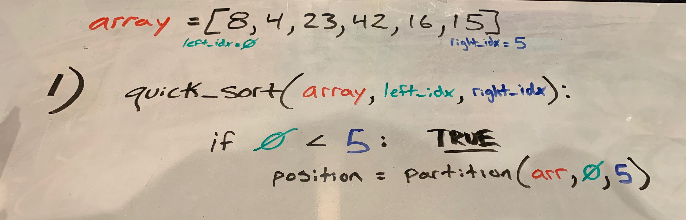
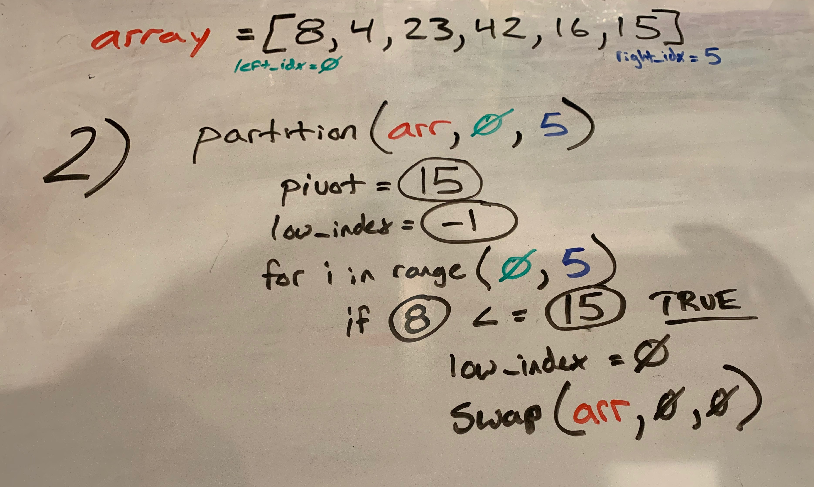
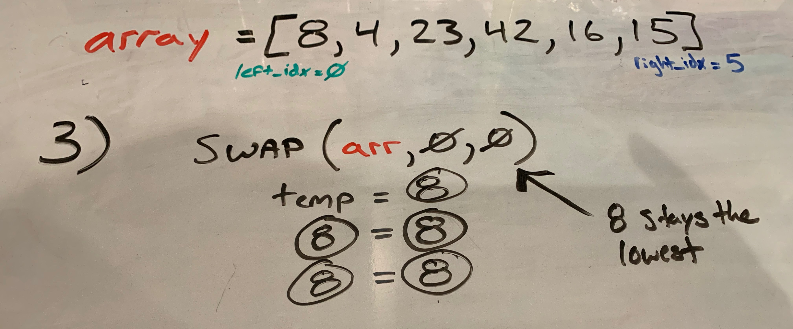
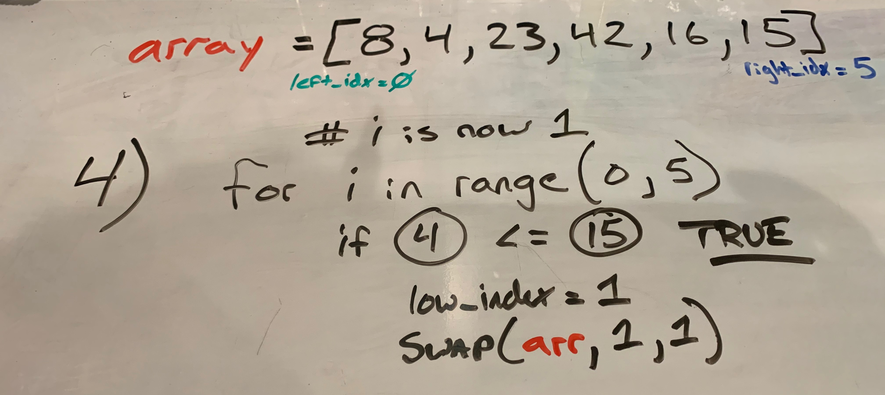
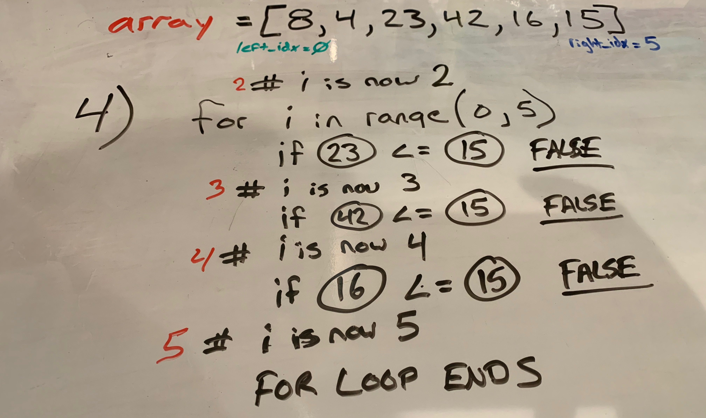
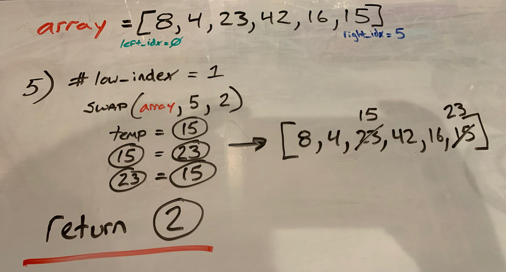
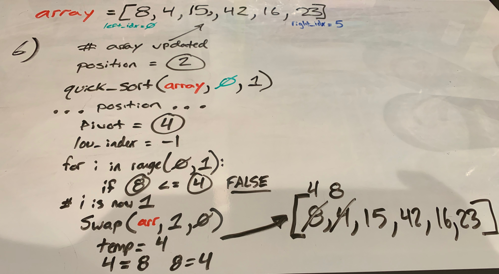
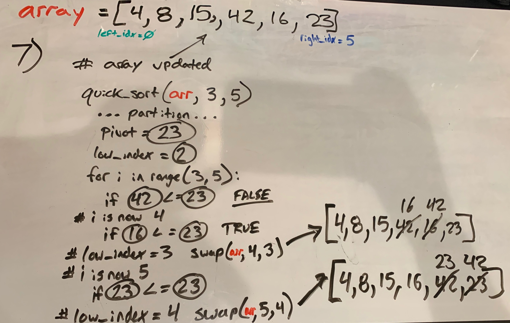
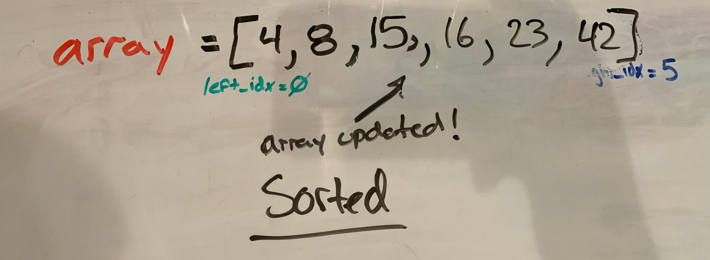

# Data-Structures-and-Algorithms - Challenge Ten

# Step-by-Step: Quick Sort
Say that you are given a list of integers in no perticular order and you would like them to be sorted. Without using any built-in functions, how would you do it?

There are many different algorithims that would get the job done. Let's take a look at the "quick sort" method of sorting.

```
def quick_sort(arr, left_index, right_index):

    if left_index < right_index:
        
        position = partition(arr, left_index, right_index)

        quick_sort(arr, left_index, position - 1)

        quick_sort(arr, position + 1, right_index)
```
Quick sort operates by using two helper function algorithms. Defined here as: partition and swap.

```
def partition(arr, left_index, right_index):
    
    pivot = arr[right_index]

    low_index = left_index - 1

    for i in range(left_index, right_index):
        if arr[i] <= pivot:
            low_index += 1
            swap(arr, i, low_index)

    swap(arr, right_index, low_index + 1)

    return low_index + 1
```
```
def swap(arr, i, low_index):
    temp = arr[i]
    arr[i] = arr[low_index]
    arr[low_index] = temp
```
Through a series of images, I hope to walk through a working algorithm for quick-sort with you!

Let's start with a simple array: [8, 4, 23, 42, 16, 15] and step into the quick sort function.



As you can see above, we have the state of the simple array, a left_index equal to 0, and a right_index equal to 5. As we step into the function, the first conditional ```if left_index < right_index:``` passes and we move onto assigning a variable 'position' to the return of ```partition(arr, left_index, right_index)```. Let's step into partition at this moment.

```
array = [8,4,23,42,16,15]
left_index = 0
right_index = 5
```



Pivot, ```pivot = arr[right_index]```, is the value at the right index. In this case 15. The low_index, ```low_index = left_index - 1```, is -1 here.

We start iterating from 0 index to index 5. In the picture we start with the very first iteration. ```i = 0```. 8 is less than 15, so the low_index becomes 0 (from -1) and we invoke the swap function and pass the array, i and low_index as arguements (```swap(arr, i, low_index)```).



Here we see the swap function at this moment - the first iteration through the for loop in partition.
```
def swap(arr, i, low_index):
    temp = arr[i] ------------> 8
    arr[i] = arr[low_index] ----> 8 becomes 8
    arr[low_index] = temp ------> 8 becomes 8
```



Back to the iterations inside of the partition function from just a moment ago. Notice that i is now 1 at the start. So we check ```if arr[i] <= pivot:``` and 4 IS less than 15. We incriment low_index to now be 1 and invoke swap again. Here we can notice a pattern.

Swap is "swapping" the two indexes passed as arguements inside of the array passed as an arguement. Before we go any further we can already tell that we are swaping index 1 with index 1. This will do the same thing as 8 previously. When 8 became 8. The original array appears unchanged.

So instead of illustrating that again, lets move quicker through 4 more iterations.



We can see that for ```i = 2``` the conditional is falsey. 23 is NOT less than or equal to 15. We increment i and take no other action. When ```i = 3``` and ```i = 4``` we also get falsey. When ```i = 5``` we are out of the range of the for loop. Loop ends.

Outside of the loop we have two lines of code remaining inside of partition. 
```
    swap(arr, right_index, low_index + 1)

    return low_index + 1
```



We invoke swap in the image above. right_index is equal to 5 and the low_index + 1 is equal to 2 at this moment. In the original array 15 is "swapped" with 23 and partition returns ```low_index + 1``` (which is 2). 

That is it for the partition function call, let's get back to quick_sort!



THe original array is updated at this point, and now ```position = 2``` from the return of partition. quick_sort gets called again. ```quick_sort(arr, left_index, position - 1)```

In the image we can see elipsis that show that we are stepping back into a partition call. The left index being 0 and ```position - 1 = 1```. Pivot is now assigned to the value at index 1, which is 4 at this point. low_index is -1.

Our for loop is for one iteration here, ```range(0,1)```. The one and only iteration is falsey on the conditional and the loop is over. Swap is invoked, passing the array and swaping values at index 1 and index 0. You can see in the image the changes to the array. 

Our array at this point is now: ```[4,8,15,42,16,23]```

You can see how this recursion will continue untill there are completely sorted "partitions". Luckily here, this side is already sorted. Let's jump back out to our very first quick_sort call.



Now we are at our final recursive call. 
```quick_sort(arr, position + 1, right_index)```

See if you can follow the image above.

When we finish iterating in partition we invoke swap. You can see when index 4 and 3 are swapped and when indexes 5 and 4 are swapped!


